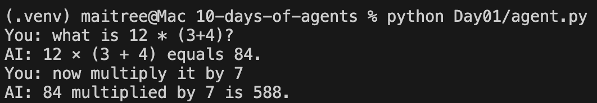
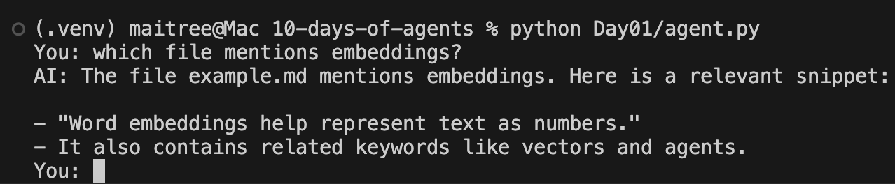
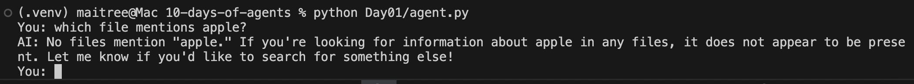

# Day 01 — Hello Toolformer (Calculator + Local Search)

This is the first project in my **10 Days of Agents** challenge.  
The goal: build a minimal agent in [LangGraph](https://github.com/langchain-ai/langgraph) that can call tools, loop through them, and finalize an answer.

---

## 🔧 Tools
- **calculator** → safe evaluation of arithmetic (supports `+ - * / ( )` and percentages like `20% of 50`).
- **local_search** → keyword search over `./data/*.md`, returns filenames + short snippets.

---

## 🧩 Workflow
The agent is a small graph with three nodes:
```

\[START] → (llm) → (run\_tool?) → (llm) → … → (finalize) → \[END]

````

- **llm**: decides what to do next, with tool schemas bound.  
- **run_tool**: executes tool calls and appends results.  
- **finalize**: produces a clean, concise final answer.  


---

## ▶️ How to Run

### Interactive mode (multi-turn REPL)

Stay in a loop until you type `exit`:

```bash
python agent.py
You: what is 12 * (3+4)?
AI: 84
You: now multiply it by 7
AI: 588
```

---

## 📸 Example Interactions

### Multi-turn (calculator)



### Search success (embeddings)



### Search miss (nonexistent word)



---

## ✨ Learnings

* **State** holds the conversation (`messages`) and a step counter.
* Tool calls are **appended** as messages, so the model can read its own past actions.
* Guardrails: unsafe calculator input blocked, search capped to `top_k`, loop limited by `steps`.

Day 1 done ✅ — next up: make retrieval smarter with embeddings!


