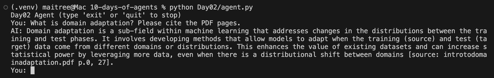
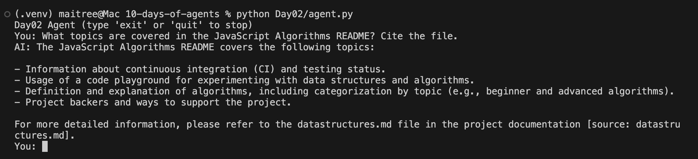
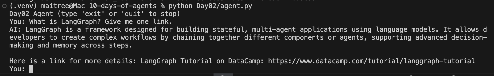
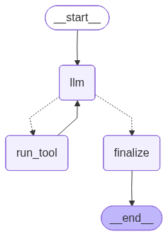

# Day 02 — Web + Files Agent (RAG with citations)

Goal: teach the agent to (1) search the web and (2) answer from **local docs** using a tiny RAG pipeline — with **citations**.

---

## 🔧 Tools added today
- **web_search(query: str)** → Tavily via LangChain. Returns a short summary (`text`) or a small list of `{title, url}`.
- **doc_query(question: str, top_k: int=4)** → queries a **Chroma** vector index built from `./data/` (PDF + Markdown). Returns snippets with `{source, page, snippet}` for citations.

> Ingestion is one-time: `doc_ingest()` loads `./data`, chunks, embeds, and stores vectors locally.

---

## 📂 Structure
```

Day02/
agent.py        # LangGraph agent (REPL or --task mode)
tools.py        # web\_search, doc\_ingest, doc\_query
states.py       # State(messages, steps)
data/           # PDFs/Markdown files
index/          # Chroma persistence (auto-created)

````

---

## 🧰 Setup

**Install (from repo root, venv active):**
```bash
pip install -U langchain langgraph langchain-openai langchain-core langchain-text-splitters \
  langchain-community langchain-chroma chromadb pypdf python-dotenv langchain-tavily
````

**.env (repo root):**

```
OPENAI_API_KEY=sk-...
TAVILY_API_KEY=tvly-...
```

> Using `from langchain_chroma import Chroma` (no manual `persist()` needed).

---

## ▶️ Usage

### 1) Build the local index (ingest once or when docs change)

```bash
python Day02/agent.py --ingest
```

Example output:

```
{'ok': True, 'files_indexed': 3, 'chunks_added': 339, 'files': [...], 'collection': 'day02_docs'}
```

### 2) Single-shot question

```bash
python Day02/agent.py --task "What is domain adaptation? Cite pages."
```

### 3) Interactive chat (multi-turn, remembers context)

```bash
python Day02/agent.py
# type questions; 'exit' to quit
```

---

## 📸 Screenshots

### Conversation examples

#### Local PDF query



#### Local Markdown query



#### Web search query



---

### Workflow graph



---

## 📝 Design choices

* **Chunking:** `chunk_size=800`, `chunk_overlap=120` — keeps passages coherent while improving match quality.
* **Embeddings:** OpenAI embeddings (picked up from `.env`).
* **Vector store:** **Chroma** with `persist_directory=Day02/index/` for fast local retrieval.
* **Citations:** every retrieved snippet carries `source` (filename) and `page` (PDFs), which the LLM includes like `[source: file.pdf p.N]`.
* **Guardrails:** cap `top_k` (default 4), trim snippets (\~240 chars), safety-cap tool loops in the graph.

---

## ⚠️ Troubleshooting

* **Chroma deprecation warning:** Use `from langchain_chroma import Chroma` and remove `vectordb.persist()`.
* **No results:** Re-run `--ingest` after adding/replacing files in `./data`.
* **High token usage:** trim history in `llm_node` (keep last \~8 messages) and keep `top_k` small (≤4).
* **Auth errors:** `echo $OPENAI_API_KEY`, `echo $TAVILY_API_KEY` to ensure the env is loaded.

---

Day 2 complete ✅ — the agent can ground on the web **and** your own files, with citations.


