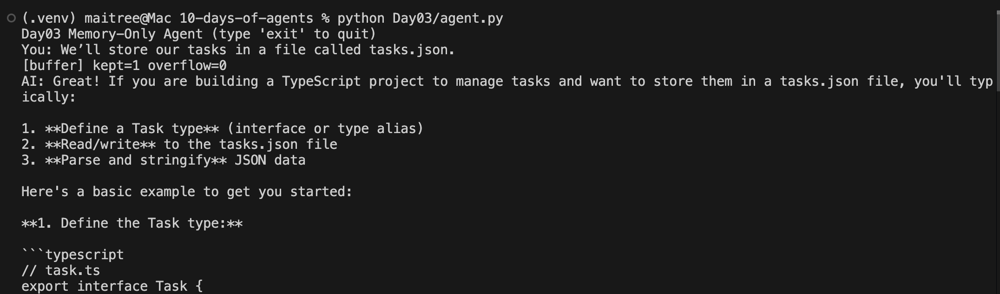
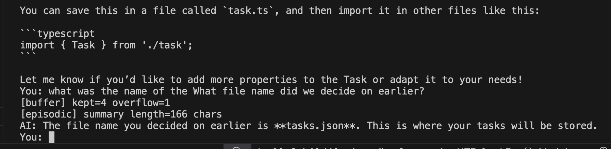
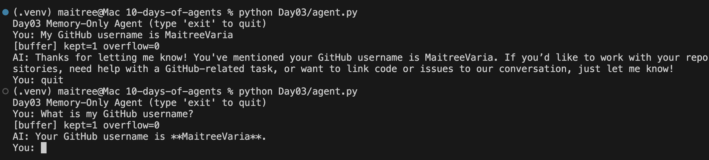
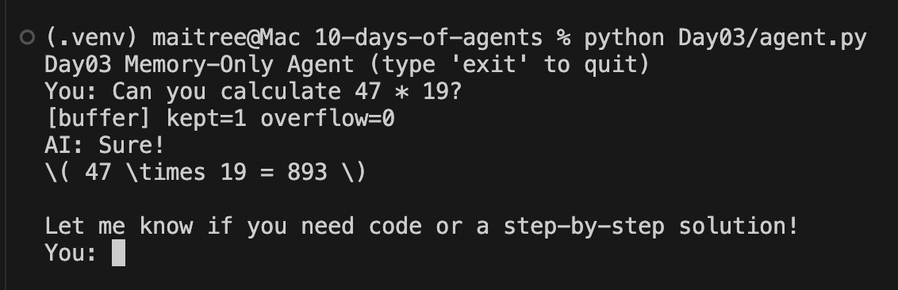

# Day 03 — Memory: Short-Term, Episodic, and Semantic

This day’s challenge focused on giving the agent a **memory system**.  
The goal was to move beyond a stateless chatbot and give it the ability to:

- **Short-term (buffer):** Keep the last N messages verbatim (default = 8).
- **Episodic (session):** Summarize older overflow messages into a short paragraph so the agent still remembers context without keeping every word.
- **Semantic (long-term):** Persist durable user facts (preferences, identity, projects) across sessions using a vector store (Chroma).

---

## 🧠 How it Works

1. **Buffer:**  
   - Keeps the last 8 turns exactly.  
   - Any overflow is removed from the state.

2. **Episodic Memory:**  
   - When overflow occurs, those messages are summarized into a 2–4 sentence note.  
   - This summary is prepended to the model as a `SystemMessage` each turn.

3. **Semantic Memory:**  
   - After each user+assistant exchange, the LLM is asked:  
     *“Is there a durable fact here worth remembering?”*  
   - If yes, the fact is extracted (short string) and stored in Chroma with metadata.  
   - Before answering, the agent searches this store for relevant facts and prepends them as `Known user context`.

4. **Forgetting / Limits:**  
   - Buffer ensures the state never grows unbounded.  
   - Semantic store can be capped, decayed, or filtered based on confidence and recency.  
   - A `memory_policy.md` defines what’s allowed to be stored (e.g., preferences, identity) and what’s not (e.g., secrets, API keys).

---

## 📂 Files

- `agent.py` — main agent loop with buffer, episodic, and semantic memory integration.
- `states.py` — defines the state object (`messages`, `steps`, `episodic_summary`).
- `memory.py` — implements `ChatBuffer`, `EpisodicMemory`, `SemanticMemory`.
- `memory_policy.md` — human-readable rules on what to store and how to forget.

---

## 🖼️ Examples

### 1. Episodic Recall
Even after many turns, the agent can recall older context via a summary.  

---

### 2. Semantic Memory (persistent facts)
Teach the agent once, restart, and ask again — it recalls from the vector store.  

---

### 3. Ignoring Ephemeral Data
Ephemeral things (like math answers) are not stored as long-term memory.  

---

## 🔧 Configuration

Toggles (env vars):

- `BUFFER_TURNS=8`
- `EPISODIC_ENABLED=true|false`
- `SEMANTIC_ENABLED=true|false`
- `MEMORY_K=3`
