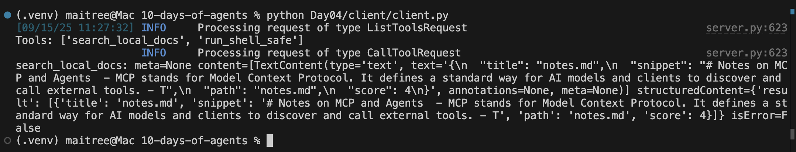
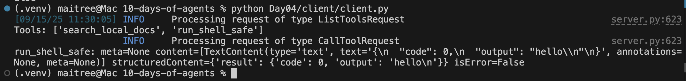

# Day 04 — Minimal MCP Server & Client

This day’s challenge was about learning **Model Context Protocol (MCP)** by building a minimal server and client.  
The goal was to understand how MCP servers expose tools with schemas, and how clients discover and call them.

---

## 🧩 What is MCP?

MCP is an open standard that lets AI models/agents connect to external tools in a safe, discoverable way.  
- **Server**: advertises tools (`search_local_docs`, `run_shell_safe`) with JSON schemas.  
- **Client**: connects to the server (via stdio here), lists tools, and calls them.  
- **Safety**: schemas, whitelists, timeouts, and controlled transports.  

---

## 📂 Structure

```

Day04/
mcp-server/
server.py
data/
notes.md
todo.txt
client/
client.py
README.md

````

---

## 🛠️ Tools implemented

### 1. `search_local_docs(query: str, top_k: int = 3)`
- Walks `./data/` for `.md` / `.txt` / `.py` files.  
- Does **keyword search** (case-insensitive).  
- Returns `{title, snippet, path, score}`.  
- Useful for local knowledge lookup.

**Example screenshot:**  


---

### 2. `run_shell_safe(cmd: str)`
- Only allows **whitelisted commands** (`ls`, `echo`).  
- Rejects anything unsafe (`rm`, pipes, redirects).  
- Enforces timeout + trims long output.  
- Useful for simple, safe environment interaction.

**Example screenshot:**  


---

## ▶️ How to run

### Start client (which launches the server under the hood):
```bash
python Day04/client/client.py
````

### Example run:

```
Tools: ['search_local_docs', 'run_shell_safe']
search_local_docs: [{'title': 'notes.md', 'snippet': 'MCP stands for Model Context Protocol...', 'path': 'notes.md', 'score': 2}]
run_shell_safe: {'code': 0, 'output': 'hello\n'}
```


---

## ✨ Next steps (stretch ideas)

* **Auth**: require `MCP_AUTH_TOKEN` env variable.
* **Rate limits**: per-tool token bucket.
* **Transport**: add SSE/websockets.
* **More tools**: GitHub search, PDF reader, etc.