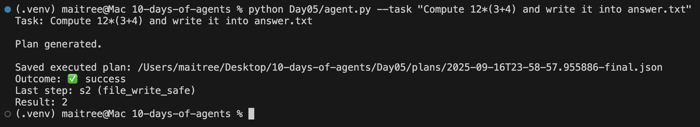
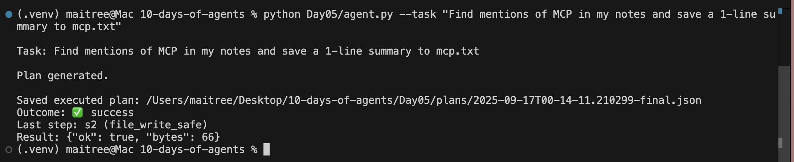

# Day 5 — Planning & Reflection

## Goal
An agent that can **plan, execute, and reflect**.  
Instead of answering directly, it first creates a structured JSON plan, executes the steps with tools, and reflects if something goes wrong.

---

## Key Concepts
- **Planner** → Breaks a task into ordered tool calls (JSON).
- **Executor** → Runs each step, records inputs/outputs, saves snapshots.
- **Reflector** → Checks results; retries or tweaks parameters when needed.
- **Templating** → Later steps reuse results from earlier ones (`{{s1.result}}`).

---

## Run

Set up environment:

```bash
python -m venv .venv && source .venv/bin/activate
pip install -r requirements.txt
````

Run with a task:

```bash
python Day05/agent.py --task "Compute 12*(3+4) and write it into answer.txt"
```

All plans are saved under `Day05/plans/` and outputs under `Day05/out/`.

---

## Example 1 — Calculator + File Write

Task:

```bash
python Day05/agent.py --task "Compute 12*(3+4) and write it into answer.txt"
```

* Planner creates 2 steps: calculator → file write.
* Executor computes `84` and writes it to `answer.txt`.

<p align="center">
  
</p>

---

## Example 2 — Search + Reflection

Task:

```bash
python Day05/agent.py --task "Find mentions of MCP in my notes and save to mcp.txt"
```

* Planner builds a plan: search → file write.
* Executor tries `search_local_docs`, but result is empty.
* Reflector tweaks parameters (`top_k`), retries, and succeeds.

<p align="center">
  
</p>

---

## Notes

* Tools available:

  * `calculator` → safe arithmetic.
  * `search_local_docs` → keyword search over `Day05/data/`.
  * `file_write_safe` → write text files under `Day05/out/`.
* Guardrails:

  * No absolute paths or directory escapes.
  * Max file size: 64 KB.
* Every run saves **step-by-step JSON** for transparency and debugging.
