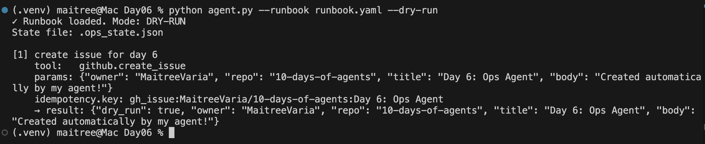
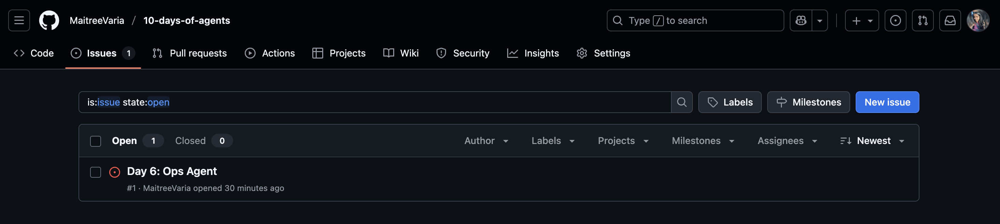

# Day 6 — Ops Agent (Real APIs + Idempotency)

This day’s challenge was about **Ops automation with real APIs**.  
Instead of just toy tools, the agent now executes **YAML runbooks** against **GitHub Issues** — safely.

---

## ✨ Features

- **Runbook as Code** → instructions written in YAML
- **Dry-run** → simulate actions without side effects
- **Idempotency** → skip steps that already succeeded
- **Retries + Backoff** → resilient to transient API errors (429 / 5xx)
- **Environment isolation** → credentials in `.env`

---

## 📁 File structure

```

Day06/
agent.py                # main runner
tools.py                # echo + github tools
idempotency\_store.py    # persistent state
retry.py                # backoff + retry helper
runbook.yaml            # example runbook
.env.example            # env template
README.md               # this file

````

---

## ⚙️ Setup

1. Copy env file and set your GitHub token:

```bash
cp .env.example .env
# then edit .env and paste your GitHub token (with repo → issues scope)
````

2. Install dependencies:

```bash
pip install requests python-dotenv pyyaml
```

---

## ▶️ Usage

Dry-run (safe simulation):

```bash
python agent.py --runbook runbook.yaml --dry-run
```

Real execution:

```bash
python agent.py --runbook runbook.yaml
```

State file (to enforce idempotency) is saved at `.ops_state.json`.

---

## 📜 Example Runbook

```yaml
steps:
  - name: create issue for day 6
    tool: github.create_issue
    params:
      owner: "MaitreeVaria"
      repo: "10-days-of-agents"
      title: "Day 6: Ops Agent"
      body: "Created automatically by my agent!"
    idempotency:
      key: "gh_issue:MaitreeVaria/10-days-of-agents:Day 6: Ops Agent"
```

---

## 🖼️ Demo Screenshots

### Dry-Run Output



### Real GitHub Issue



---

## 🛡️ Safety Design

* **Dry-run**: always test with `--dry-run` first.
* **Idempotency**: deterministic keys ensure “run once” actions.
* **Retries**: exponential backoff protects against flaky APIs.
* **Least Privilege**: GitHub token only needs `repo → Issues` scope.

---

## ✅ Learning Goals

* How to treat **YAML runbooks as declarative ops plans**.
* Wrapping a real API safely with **dry-run + idempotency + retries**.
* Why idempotency differs from agent state (safety vs memory).

```

---

📌 For the screenshots:
- Run with `--dry-run` and copy the console output → screenshot → save to `Day06/images/dry-run.png`.  
- After a real run, open the created GitHub issue in your repo → screenshot → save to `Day06/images/gh-issue.png`.  

Then the README will render them inline.  

---

Do you want me to also suggest a **short caption** under each screenshot (like “Agent simulating runbook steps” / “Issue created by agent”)?
```

