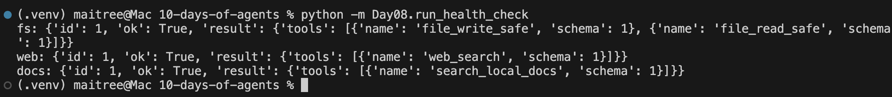
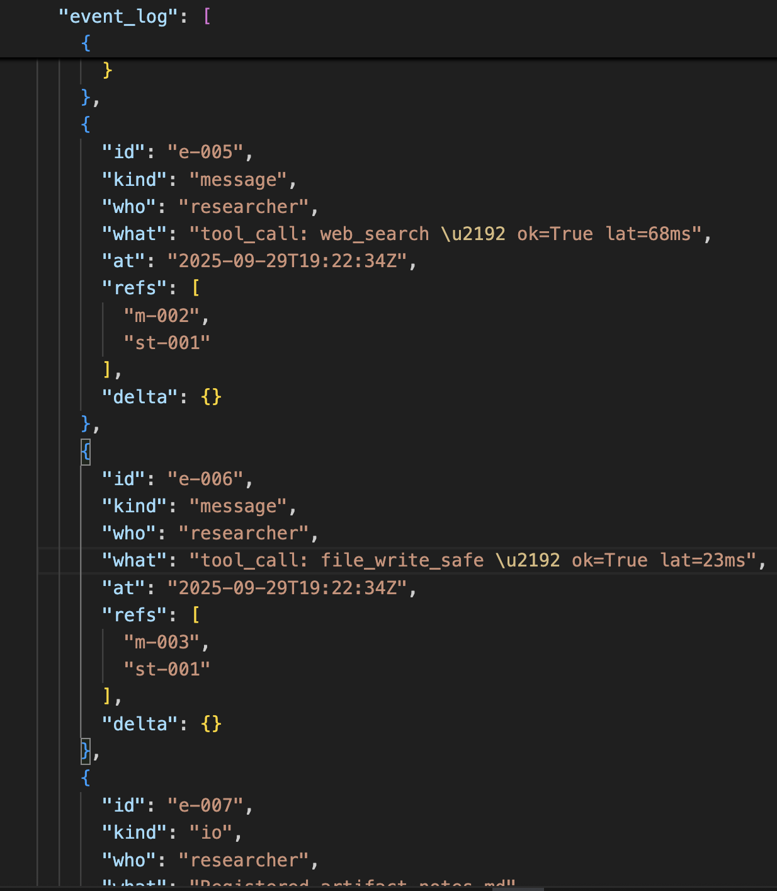
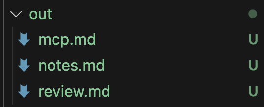
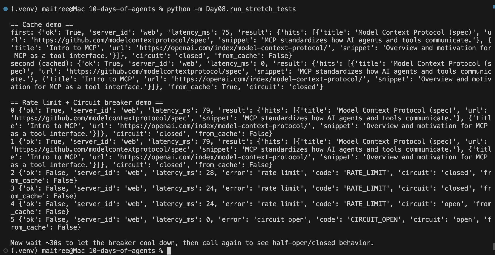

```markdown
# Day 08 — Tool Mesh via MCP (with Rate Limits, Circuit Breaker, and Cache)

Turn the Day-7 multi-agent system into a **tool mesh**: every tool lives behind an MCP server, and agents (Researcher, Coder, Critic) only call tools via an MCP **client adapter**. The **Supervisor** and **Blackboard** stay conceptually the same.

---

## What’s new vs Day 07

- **All tools behind MCP** (stdio servers):  
  - `fs-mcp`: `file_write_safe`, `file_read_safe` (sandboxed to `Day08/out/`)  
  - `web-mcp`: `web_search` (stubbed hits for “mcp”)  
  - `docs-mcp`: `search_local_docs` (finds local `.md` in Day07 & Day08)
- **Central registry** (`registry/endpoints.yaml`) tells the adapter how to start/locate servers.
- **Adapter** (`client/adapter.py`) is the *only* way agents call tools.
- **Stretch features**:
  - **Server-side rate limits** → returns `code="RATE_LIMIT"`.
  - **Circuit breaker** (adapter) → opens after repeated failures → returns `code="CIRCUIT_OPEN"`.
  - **Response cache** (adapter) → caches read-only tools for 60s (`from_cache=True`).

Agents now log `ok`, `latency_ms`, `from_cache`, and `circuit` into the blackboard.

---

## Folder layout

```

Day08/
agents/
researcher.py
coder.py
critic.py
client/
adapter.py           # MCP client + breaker + cache
.state/
breaker.json       # persisted breaker state
cache.json         # response cache
servers/
fs-mcp/
server.py          # sandboxed reads/writes under Day08/out
rate_limit.json    # per-minute counters (auto-created)
web-mcp/
server.py          # stubbed web_search + rate limit
rate_limit.json
docs-mcp/
server.py          # local .md search + rate limit
rate_limit.json
registry/
endpoints.yaml       # tool registry (discovery/config)
out/                   # artifacts for Day 08
blackboard/
storage.json         # live run state
snapshots/           # snapshots
graph_supervisor.py    # single-node LangGraph supervisor (tick)
run_health_check.py    # server discovery test
run_graph_demo.py      # end-to-end run; writes run.json snapshot
run.json               # final snapshot (created by runner)

````

> We **reuse** Day-7 blackboard: `from Day07.blackboard import Blackboard`.  
> Ensure both `Day07/` and `Day08/` have `__init__.py`.

---

## Quickstart

Install deps:

```bash
pip install pyyaml
````

Run server discovery:

```bash
python -m Day08.run_health_check
# Expect tools list from fs, web, docs
```

Run end-to-end (research → code → review), all via MCP:

```bash
python -m Day08.run_graph_demo
# Example:
# Graph status: done
# notes.md: True
# mcp.md: True
# review.md: True
# Snapshot: Day08/blackboard/snapshots/<ts>-final.json
# Final run.json: Day08/run.json
```

Artifacts produced:

* `out/notes.md` (Researcher)
* `out/mcp.md` (Coder)
* `out/review.md` (Critic)

---

## How it works

### Supervisor (single-node `tick`)

1. **Acceptance check** → stop if met.
2. **Run one** queued subtask (researcher/coder/critic).
3. **Plan** the next subtask when idle (research → code → review).
4. **Stop** when acceptance is met, budget exceeded, or nothing left to do.

Uses LangGraph `Command(goto=...)` so the graph can’t spin forever.
Blackboard is persisted to `blackboard/storage.json` each step.

### Blackboard (same core schema as Day 7)

* `task`, `subtasks`, `artifacts`, `messages`, `event_log`, `locks`, `metrics`
* Tool calls are logged as messages, e.g.:

  ```
  "role": "researcher",
  "type": "tool_call",
  "content": "web_search → ok=True lat=76ms cache=False circuit=closed"
  ```

---

## MCP registry

`registry/endpoints.yaml` is the source of truth for servers and tools:

```yaml
version: 1
servers:
  fs:
    id: fs-mcp
    protocol: stdio
    command: ["python", "server.py"]
    cwd: "./Day08/servers/fs-mcp"
    tools:
      - name: file_write_safe
        schema: 1
      - name: file_read_safe
        schema: 1
  web:
    id: web-mcp
    protocol: stdio
    command: ["python", "server.py"]
    cwd: "./Day08/servers/web-mcp"
    tools:
      - name: web_search
        schema: 1
  docs:
    id: docs-mcp
    protocol: stdio
    command: ["python", "server.py"]
    cwd: "./Day08/servers/docs-mcp"
    tools:
      - name: search_local_docs
        schema: 1
```

The adapter reads this file to start the right process for each tool call.

---

## Adapter (with breaker + cache)

`client/adapter.py`:

* **mcp_call(tool, args)** → returns `{ok, server_id, latency_ms, result|error, from_cache, circuit}`
* **Cache**: 60s TTL for `web_search` and `search_local_docs` (read-only).
* **Circuit breaker** per tool:

  * Opens after **3 failures** within **60s**.
  * **30s cooldown**, then half-open (next success closes it).
  * Open breaker returns `code="CIRCUIT_OPEN"` instantly.

Adapter state is persisted in `client/.state/`.

---

## Server-side rate limits

Each server keeps a tiny `rate_limit.json` next to its `server.py`.
Limits (per tool, per minute):

* **fs-mcp**: `file_write_safe: 60`, `file_read_safe: 120`
* **web-mcp**: `web_search: 3` *(small on purpose to demo breaker)*
* **docs-mcp**: `search_local_docs: 10`

When exceeded, the server returns `{ok:false, code:"RATE_LIMIT"}`.
The adapter records failures; enough failures → breaker opens.

---

## Tests for stretch features

Run the stretch tests:

```bash
python -m Day08.run_stretch_tests
```

Expected flow:

* First `web_search` is remote (`from_cache=False`), second is cached (`from_cache=True`).
* After ~3 uncached calls, server returns `RATE_LIMIT`, adapter accumulates failures → `circuit=open`.
* While open, calls fast-fail with `CIRCUIT_OPEN`. After ~30s cooldown, next call tries again.

---
## Screenshots






---

## Troubleshooting

* **`ModuleNotFoundError: Day07`**
  Ensure `Day07/__init__.py` and run from repo root with `python -m Day08.run_graph_demo`.

* **`No module named 'Day08.agents'`**
  Ensure `Day08/agents/__init__.py` exists.

* **Paths / sandbox**
  FS server only reads/writes under `Day08/out/`. When reading a path like `out/mcp.md`, the agents strip the `out/` prefix before calling `file_read_safe`.

* **Recursion limits**
  The supervisor uses a single `tick` node with `Command(goto=...)` and a `max_steps` budget, so it halts deterministically.

---

## How to add a new tool/server

1. Create a new server folder `Day08/servers/<name>-mcp/` with a `server.py` that supports:

   * `{"method":"list_tools"}`
   * `{"method":"call", "params":{"tool":"...", "args":{...}}}`
2. Add it in `registry/endpoints.yaml` under `servers:`.
3. Call it from agents via `MCPClient.mcp_call("tool_name", args)`.

---

## Acceptance checklist

* [x] `registry/endpoints.yaml` lists fs/web/docs tools.
* [x] `run_health_check` prints all tools.
* [x] `run_graph_demo` produces `out/notes.md`, `out/mcp.md`, and `out/review.md`.
* [x] Blackboard shows tool-call messages with `latency_ms`, `from_cache`, and `circuit`.
* [x] Rate limit, breaker, and cache verified via `run_stretch_tests`.
* [x] README explains how to run and how to add/replace a server.

---

## Why MCP here

* **Abstraction & hot-swap**: agents don’t import tool code; registry can point to new servers without touching agent logic.
* **Safety boundaries**: each server enforces its own sandbox/limits.
* **Observability**: per-call latencies and statuses are centrally logged in the blackboard.
* **Scale**: different teams can own different servers and upgrade independently.

---

## Notes

* Time warnings: some scripts were updated to **timezone-aware UTC** (e.g., `datetime.now(UTC)`).
* The web server is **stubbed** to be deterministic; swap it for real search when you’re ready.
* The adapter currently launches a **fresh server process per call** for simplicity—moving to long-lived daemons or HTTP is a natural follow-up.

```