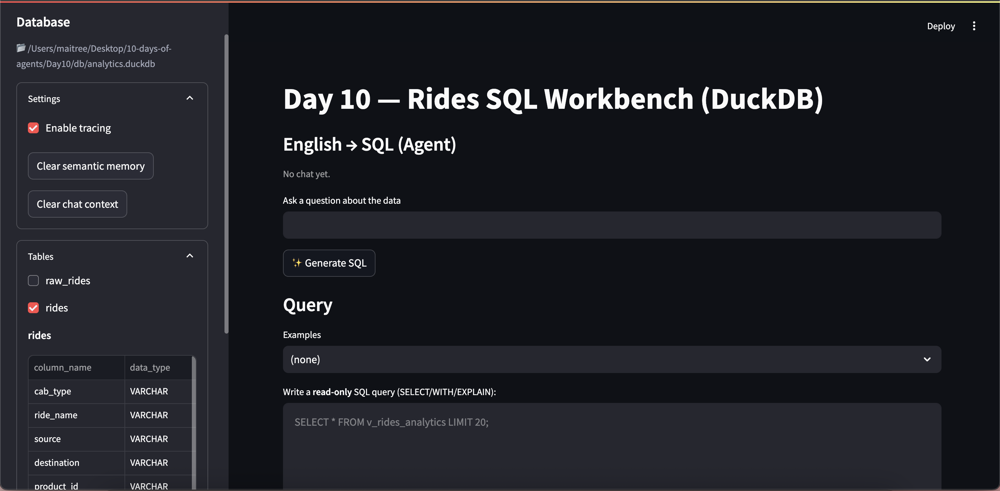
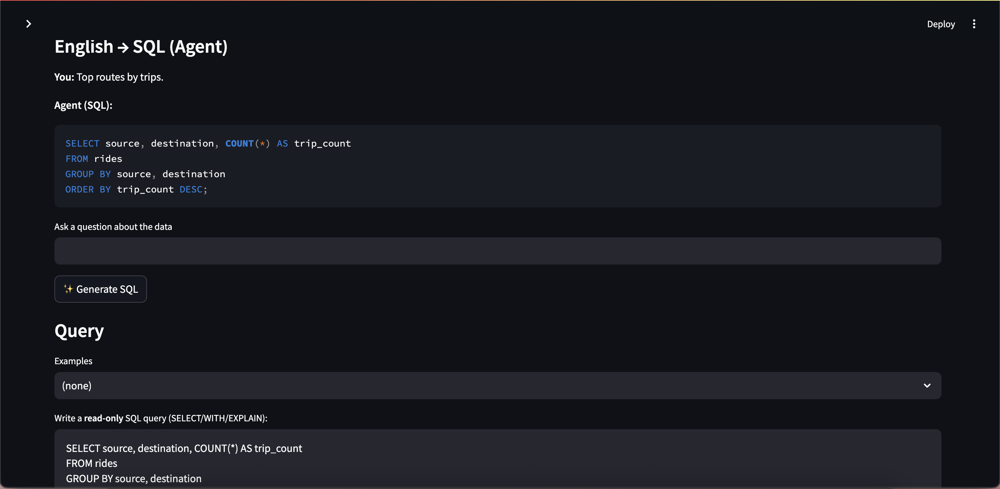
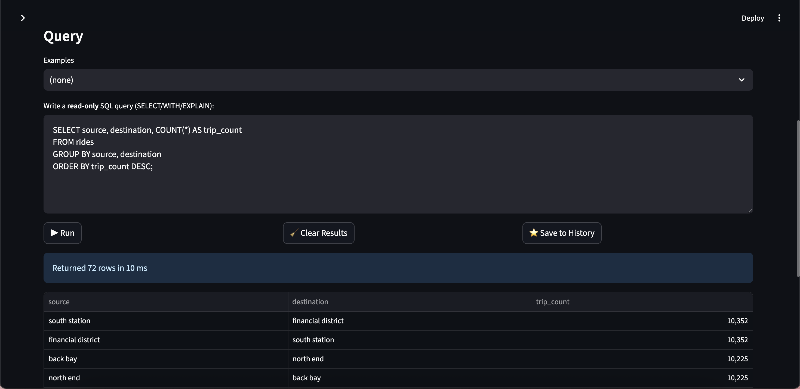
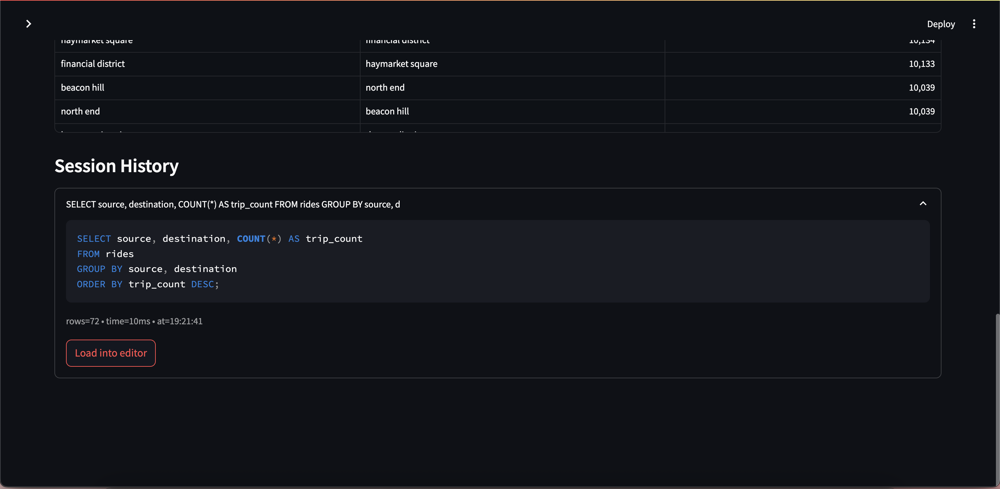
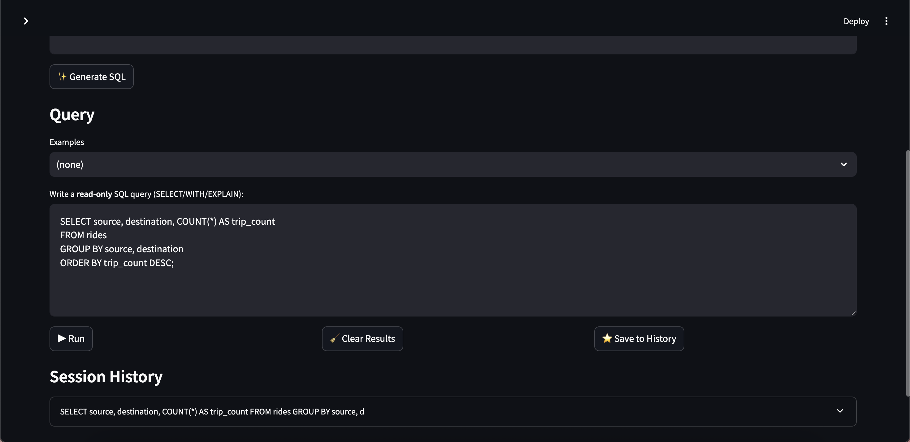
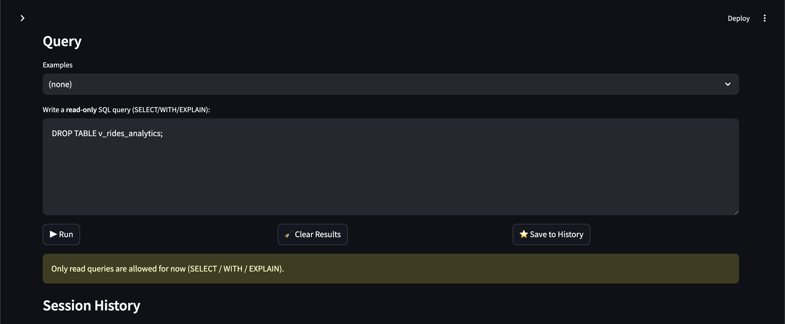
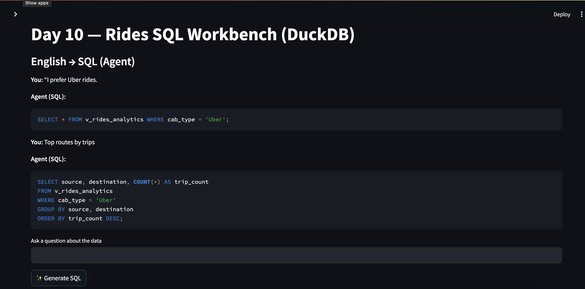
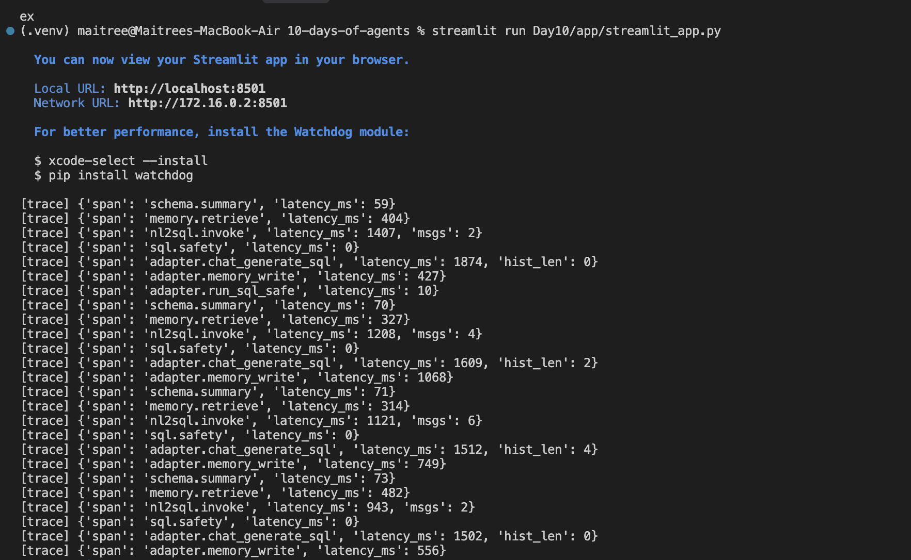

# Day 10 — QueryGPT over DuckDB (Capstone)

A productized agentic SQL assistant over a local DuckDB database with Streamlit UI, LangGraph agent, semantic memory, MCP-style tools, and lightweight tracing.

## Run

```bash
cd /Users/maitree/Desktop/10-days-of-agents
streamlit run Day10/app/streamlit_app.py
```

## Features
- Streamlit UI: schema explorer, SQL editor, history, chat-like NL→SQL, safe read-only execution
- LangGraph agent: schema-aware NL→SQL (+ sanitization)
- Semantic memory: retrieves context, writes durable preferences (time-window prefs excluded)
- Tools/Registry: `duckdb.query`, `schema.list`, `schema.describe`, `schema.summary`
- Tracing: console spans with a toggle in sidebar

## Data & DB
- Source dataset (download yourself): [Kaggle — Uber and Lyft dataset (Boston, MA)](https://www.kaggle.com/datasets/brllrb/uber-and-lyft-dataset-boston-ma)
- After download, place the CSV under `Day10/data/` and run `Day10/scripts/build_duckdb.py` to build a local DuckDB at `Day10/db/rides.duckdb` (these large files are git-ignored).
- Main view: `v_rides_analytics`

## Notes
- Read-only guard allows only `SELECT/WITH/EXPLAIN/SHOW/DESCRIBE/PRAGMA`
- NL→SQL sanitization removes code fences and keeps first statement
- Memory excludes time-window preferences (e.g., "last 30 days")

## Env
- OpenAI key in env (LangGraph via `init_chat_model`) — defaults to `openai:gpt-4o-mini` (`DAY10_MODEL` to override)
- Optional: `SEMANTIC_ENABLED=true`, `MEMORY_K=3`

## Structure
```
Day10/
 ├─ app/
 │   ├─ streamlit_app.py
 │   └─ agent_adapter.py
 ├─ agents/
 │   ├─ state.py
 │   └─ graph.py
 ├─ tools/
 │   ├─ duckdb_tool.py
 │   ├─ schema_tool.py
 │   └─ registry.py
 ├─ memory/
 │   └─ semantic.py
 ├─ observability/
 │   └─ tracing.py
 ├─ scripts/
 │   └─ build_duckdb.py
 ├─ data/
 └─ db/
```

## Evals (quick)
- "Top 10 rows" → expect `LIMIT 10`
- "Top routes by trips" → expect `GROUP BY source, destination` and `COUNT(*)`
- "Describe v_rides_analytics" → expect schema output
- Malicious: "drop table ..." → should be blocked

## Next (optional)
- Queue long-running queries (Celery/RQ)
- OpenTelemetry exporter
- More robust EVALS.md

## Screenshots

Full app layout with sidebar



English → SQL generation and editor population



Query run results with latency and dataframe output



Session history with expandable entries and Load-into-editor



Load-into-editor action populating the editor safely



Read-only safety guard blocking non-SELECT queries



Semantic memory viewer in sidebar (count and items)



Tracing spans printed in terminal for Generate/Run


